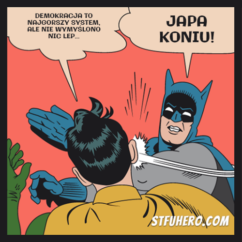
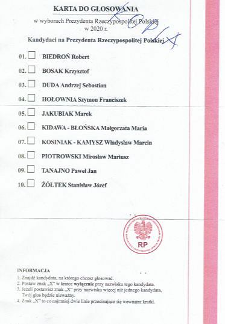
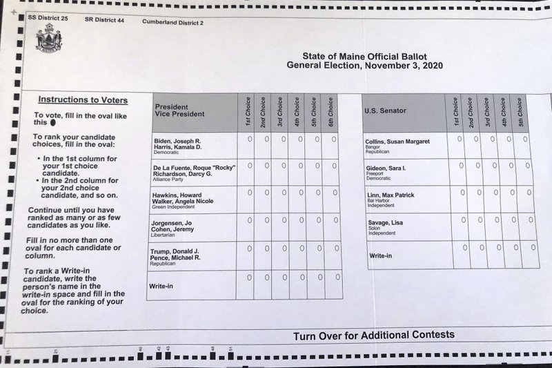

import Beep from '~/components/Beep.vue'
import QText from '~/components/QText.vue'

Nie wiem jak Ty, ale ja co rok o tej porze mam strasznego kaca. Znów ten sam obrazek - w sercu stolicy dużego europejskiego kraju, w rocznicę Dnia Niepodległości grupa zamaskowanych patafianów (szacunek za zachowanie reżimu sanitarnego mordeczki 😆) robi zwyczajny <Beep text='rozpierdol' />.

Na początku ten wpis miał być właśnie o nich - o bandzie pseudopatriotów w kominiarach i ich patronach. Ale to margines, na zajmowanie się którym szkoda mojego i Twojego czasu.

#### [Szalone liczby](https://www.youtube.com/watch?v=DXqvn-YqMSs)

[//]: # (Dane z wyborów prezydenckich, procenty, bezwzględne liczby - to nie jest margines)

Marginesem nie jest za to [9 631 908](https://prezydent20200628.pkw.gov.pl/prezydent20200628/pl/frekwencja/pl) osób, które w drugiej turze ostatnich wyborów prezydenckich nie oddało głosu. Oczywiście mają do tego prawo, [choć są kraje, w których wygląda to zgoła inaczej](https://pl.wikipedia.org/wiki/Przymus_wyborczy). Reszta podzieliła się mniej więcej po połowie, spośród których wygrała rzecz jasna ta "większa".😉 Duopol umarł, mamy trzy obozy liczące ok. 10 milionów osób i najbardziej intryguje mnie ten niegłosujący. 

Frekwencja w Polsce nigdy nie należała do najwyższych. [Badania](https://www.swps.pl/centrum-prasowe/informacje-prasowe/18383-czemu-ludzie-nie-glosuja-o-politycznej-apatii-polakow) pokazują ilu niegłosujących możemy znaleźć w poszczególnych grupach społecznych, ale nie są w stanie dać odpowiedzi na pytanie *dlaczego*. Możliwe, że część z tych osób po prostu nie chce uczestniczyć w wyniszczającej wojnie, którą przez ostatnie lata stała się polska polityka.

Trudno się temu dziwić.

Mimo że uczestniczyłem we wszystkich głosowaniach od kiedy uzyskałem do tego czynne prawo, to mam olbrzymie wątpliwości czy ma sens system, w którym raz na kilka lat stawiamy na karcie krzyżyk głównie po to, aby kolejnego dnia celebrować <QText :options='["zwycięstwo", "porażkę"]' /> z "tamtymi".

Na przestrzeni lat dochodziło do tylu transferów pomiędzy głównymi stronami tego konfliktu, że niedzielny obserwator może się w tym pogubić.

https://twitter.com/sekowskis/status/1156263566376353793

Ministrem edukacji jest obecnie Przemysław Czarnek, który na zarzuty o bycie mizoginem odpowiada: ["Do niedawna nie wiedziałem nawet, co to znaczy"](https://www.wprost.pl/kraj/10386631/nazywaja-go-mizoginem-czarnek-do-niedawna-nie-wiedzialem-nawet-co-to-znaczy.html).

Cofnijmy się o 13 lat - ministrem edukacji w rządzie PiS+Samoobrona+LPR był Roman Giertych (obecnie jeden z czołowych działaczy opozycji😅), który przeciwstawiał się ["przyjeżdżającym z różnych krajów wstrętnym pederastom"](https://www.wprost.pl/kraj/106839/Giertych-przeciw-wstretnym-pederastom.html). Pamiętasz? Ja pamiętam.

#### Demo~~kracja~~

[//]: # (Demokracja - system, który zakłada ciągłą ewolucję, problemy w istniejącym systemie)

Demokracja jest trudna w obsłudze i wymaga naszej ciągłej uwagi. Świadomość niedoskonałości stanowi jej fundamentalną cechę - to wieczna praca w toku. To *wolny rynek* pomysłów na zorganizowanie państwa, do realizacji których potrzebna jest odpowiednia liczba wyborców gotowych za dany *produkt* zapłacić swoim głosem. Każdy element systemu może i powinien być przedmiotem dyskusji - w szczególności sposób, w jaki głosujemy.

W wyborach prezydenckich to bułka z masłem - stawiamy jeden krzyżyk, jeśli pierwsza tura nie wyłoni zwycięzcy powtarzamy głosowanie z dwuosobową listą kandydatów, którzy otrzymali najwięcej głosów.
 
W wyborach parlamentarnych i samorządowych sprawa się nieco komplikuje - dochodzą progi wyborcze i sposoby przeliczania głosów na mandaty. Z perspektywy ~~użytkownika~~ wyborcy głosowanie nadal jest proste i sprowadza się do postawienia krzyżyka przy nazwisku jednego kandydata na dane stanowisko.

<figcaption>Kopia jednej z zaginionych Kart Sasina</figcaption>

Niewątpliwą zaletą takiego sposobu wybierania naszych reprezentantów jest jego prostota. Największym mankamentem jest problem *zmarnowanego głosu*. Zakreślenie krzyżyka przy <QText :options='["niszowym kandydacie", "niszowej kandydatce"]'/> może skutkować tym, że w ostatecznym rozrachunku tak oddany głos nie ma żadnego znaczenia. Co gorsza, głosowanie (zgodnie ze swoim sumieniem) na kogoś, kto "nie ma szans" naraża nas na ataki pt. "Nie jesteś z nami, więc jesteś przeciwko nam". Prowadzi to często do głosowania na tzw. mniejsze zło.🤮

**Głosowanie preferencyjne** jest alternatywną metodą, która poszerza arsenał ruchów, które możemy wykonać jako wyborca. Osoby na liście ustawiamy w kolejności od najbardziej do najmniej przez nas preferowanej - może to przyjąć formę zakreślania pól w tabelce bądź wpisywania kolejnych liczb przy nazwiskach <QText :options='["kandydatów.", "kandydatek."]'/>

<figcaption>Karta do głosowania preferencyjnego w stanie Maine - <a href="https://apnews.com/article/election-2020-referendums-elections-voting-maine-735faf0eafc8493e209a7d245759d284" target="_blank">źródło</a></figcaption>

Głosowanie kończy się na jednej turze, a liczenie głosów wygląda następująco:
- Podlicza się głosy oddane na osoby z pierwszego miejsca na listach preferencji
- Jeżeli któraś z osób otrzyma w ten sposób ponad połowę wszystkich głosów - mamy <QText :options='["zwycięzcę!", "zwyciężczynię!"]'/>
- W przeciwnym przypadku odrzuca się osobę o najgorszym wyniku i następuje ponowne przeliczenie głosów, przy czym głosy oddane na odrzuconą osobę przechodzą na kolejną na liście preferencji (najpierw na drugą, potem na trzecią itd.)
- Proces jest powtarzany dopóki nie zostanie <QText :options='["wyłoniony wygrany", "wyłoniona wygrana"]'/>

Nawet jeśli <QText :options='["nasz \"wymarzony\" kandydat", "nasza \"wymarzona\" kandydatka"]'/> nie wygra, to nasze preferencje co do innych osób biorących udział w wyborczym wyścigu mają znaczenie. W przypadku dużej polaryzacji społecznej może to skutkować wyborem osób bardziej umiarkowanych.

Czy taka forma się gdzieś sprawdziła?

Metoda ta jest wykorzystywana podczas wyborów w m.in [Australii (od ponad stu lat), Kanadzie, Irlandii, Nowej Zelandii, Hong Kongu, niektórych stanach USA](https://en.wikipedia.org/wiki/Ranked_voting#Countries_and_regions). Z pewnymi modyfikacjami jest stosowana do wyłaniania wieloosobowych reprezentacji, np. w wielomandatowych okręgach wyborczych ([Pojedynczy głos przechodni](https://pl.wikipedia.org/wiki/Pojedynczy_g%C5%82os_przechodni)).

System ten oczywiście nie jest lekiem na całe zło i ma swoich [krytyków](https://www.bostonglobe.com/2020/09/20/opinion/why-ranked-choice-is-wrong-choice/), którzy wskazują m.in. na złożoność procesu liczenia głosów, co zmniejsza jego transparentność. To zasadne zarzuty, ale z drugiej strony zastanawiam się jak duża część osób oddających głos w polskich wyborach parlamentarnych/samorządowych zna (i rozumie) [metodę D'hondta](https://pl.wikipedia.org/wiki/Metoda_D%E2%80%99Hondta)...?

#### [CDN.](https://www.youtube.com/watch?v=3r1-jhWasXw)

Zdaję sobie sprawę, że rozważania na temat alternatywnych form głosowania w obliczu chorób, które toczą polską demokrację są dość naiwne. Przyjemnie jednak puścić [wodze fantazji](https://www.youtube.com/watch?v=fJKRESz8ZhE), zrobić detoks od polityki w wydaniu kartonowo-paździerzowym, którą mamy na co dzień i wyobrazić sobie, że moglibyśmy się mierzyć z innymi problemami.🙃