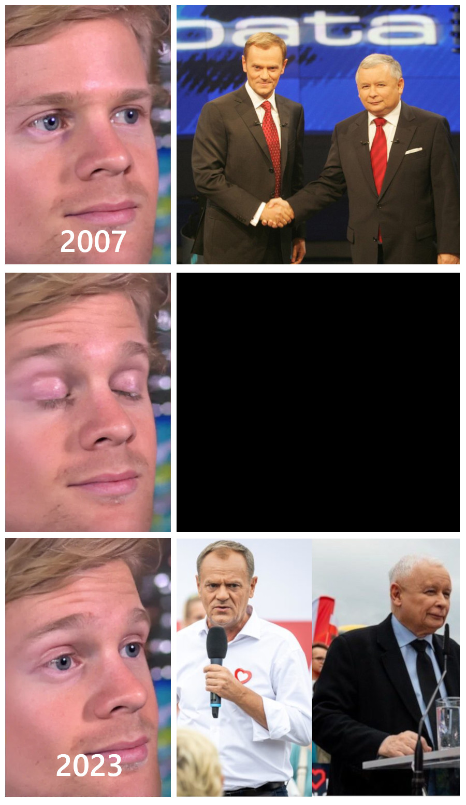

import QText from '~/components/QText.vue'

Już w najbliższą niedzielę wybierzemy <QText :options='["naszych reprezentantów", "nasze reprezentantki"]'/> do X kadencji Sejmu RP. Kampania wyborcza dobiega końca, a według [ostatnich sondaży](https://www.onet.pl/informacje/onetwiadomosci/wybory-2023-ostatnie-sondaze-przedwyborcze-w-jednym-miejscu/e8zz278,79cfc278) grupa niezdecydowanych osób jest na tyle liczna, że może mieć decydujący wpływ na układ sił w przyszłym parlamencie. Jeżeli nadal nie wiesz na kogo zagłosować, to jeszcze nie wszystko stracone - do otwarcia lokali wyborczych zostało trochę czasu.😅

## Zdecydowanie namawiam niezdecydowanych

Sprawdź swoje miejsce głosowania w [Centralnym Rejestrze Wyborców](https://www.gov.pl/web/gov/sprawdz-swoje-dane-w-centralnym-rejestrze-wyborcow2) i listę <QText :options='["kandydatów", "kandydatek"]'/> na stronie [Państwowej Komisji Wyborczej](https://wybory.gov.pl/sejmsenat2023/pl/kandydaci).

Poniżej zamieszczam odnośniki do materiałów, które mogą Ci pomóc w podjęciu decyzji.🫡

##### Programy komitetów wyborczych, które zarejestrowały kandydatów do Sejmu w całej Polsce (kolejność wg numeru listy)

- [Bezpartyjni Samorządowcy](https://bezpartyjnisamorzadowcy.pl/wp-content/uploads/2023/09/Bezpartyjni-Samorzadowcy-PROGRAM-2023.pdf)
- [Trzecia Droga (Polska 2050/PSL)](https://polska2050.pl/trzecia-droga/12-gwarancji-trzeciej-drogi/)
- [Nowa Lewica](https://lewica2023.org/program-wyborczy-kw-nowa-lewica/)
- [Prawo i Sprawiedliwość](https://pis.org.pl/media/download/2604996161f8fcbe3f0c507d58337156fa013e4e.pdf)
- [Konfederacja](https://konfederacja.pl/app/uploads/Konfederacja_WiN_Program_2023-1.pdf)
- [Koalicja Obywatelska](https://100konkretow.pl/wp-content/uploads/2023/09/100konkretow.pdf)

##### Kwestionariusze/ankiety

- [Latarnik Wyborczy](https://latarnikwyborczy.pl/)
- [Mam Prawo Wiedzieć](https://mamprawowiedziec.pl/porownywarka-wyborcza-2023)
- [Cyfrowy Kompas Wyborczy](https://kompas.digitalpoland.org/)

##### Analizy programów wyborczych

- [Demagog - analiza programów z podziałem na konkretne obszary](https://demagog.org.pl/analizy_i_raporty/nie-wiesz-na-kogo-glosowac-zobacz-co-obiecuja-politycy/)
- [CenEA - Podatki i świadczenia](https://cenea.org.pl/wp-content/uploads/2023/10/komentarzwyborczycenea_09-10-2023.pdf)
- [OPZZ - Prawa pracownicze](https://www.opzz.org.pl/assets/noweopzz/media/files/797991f2-e210-460b-bf93-f3b1beacd99c/reflektoropzz-edycja-trzecia.pdf)
- [Organizacje działające na rzecz ochrony zwierząt](https://www.wyborydlazwierzat2023.pl/)
- [FOR - Koszty obietnic wyborczych](https://wybory2023.money.pl/licznik-obietnic-wyborczych)
- [Niebezpiecznik - Cyberbezpieczeństwo](https://niebezpiecznik.pl/post/cyberbezpieczenstwo-w-programach-wyborczych-polskich-partii/)
